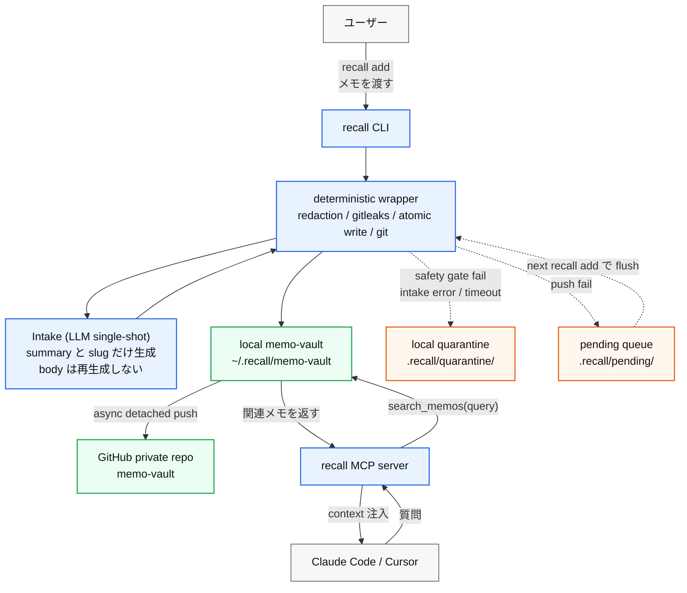
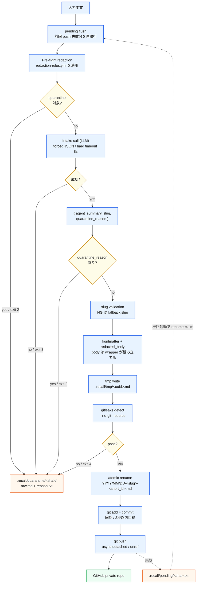

# Spec v0.1 - AI メモアシスタント（仮称: Recall）

> **このドキュメントの位置づけ（正）**: これは Recall の **フル設計仕様（正）**。bug-list #11 ★「取ったメモが見返されない」を起点に design を一通り書き切ったもの。
> **実装の順序は [`../../plans/`](../../plans/) を正とする**。まず MVP スライス（v0.1 = `recall add`〔LLM 1回で要約 + GitHub commit/push〕/ smart search MCP / `recall init`）を出し、本 spec で「v0.1 必須」と書いた content safety gate / atomic write / async push + pending queue / 24 test path 等は **plans の後続フェーズ**で積む。
> つまり **spec = 全体構想、plans = 実際のビルド順序**。両者がズレたら plans のビルド順序を優先する。

---

## 1. プロダクト概要

### 1行説明

**「IDE で AI に質問したら、過去の自分のメモが自動で context に入っている」** 体験を作る。
v0.1 は **`recall add` CLI（Anthropic SDK の tool-use forced JSON ベース）** がメモを **LLM (intake)** に渡して整形 → GitHub の `memo-vault` に commit/push、**MCP server** がローカル vault を AI クライアントに exposes する。UI はゼロから作らない。本物の agentic loop は v0.5 F5 (Curator Agent) で導入する。

### 解決する困りごと

- メモを取った瞬間に満足し、二度と開かない
- どこに書いたか思い出せず、検索しても出てこない
- 「整理しなきゃ」と思うほど億劫になり、結局 一生 整理されない

### 1年前にはなかった選択肢を使う

- **Claude Agent SDK / Anthropic SDK tool-use forced JSON**: 2025-2026 で成熟。1 回の API call で構造化 JSON を schema 固定で返させられる。pure function として LLM intake を呼べる
- **MCP（Model Context Protocol）**: 2025年標準化、2026年に主要 AI IDE が対応。「UI を自作しなくても、AI クライアント側が必要なときにメモを引いてくれる」が成立
- **GitHub をストレージに**: バージョン管理・grep・PR レビュー・ポータビリティを無料で獲得

### 既存ソリューションとの差分

| 既存 | Recall v5 |
|---|---|
| Mem.ai / Reflect: クラウドロックイン | GitHub Markdown でポータブル |
| Obsidian: ユーザーが整理する前提 | **LLM intake が capture 時に整形・要約・push を自動化** (継続整理は v0.5 curator agent) |
| Cursor / Claude Code 内蔵 memory: 1ツール内に閉じる | MCP で複数 IDE 横断、ストレージは GitHub |
| 全文検索: 検索しに行く必要がある | AI クライアントが必要な時に MCP 経由で自動取得 |

---

## 2. ターゲットユーザー

### Primary（v1 検証対象）

- **自分自身（usagi1114）** — AI IDE（Claude Code / Cursor）で日常的にコーディング・執筆する人
- 過去のメモが Notion / Apple Notes / Slack 自分宛 DM に散らばっている
- 「あの時調べたはずなのに思い出せない」を週に何度か経験

### 非ターゲット（あえて切る）

- IDE を使わない人 → v1 では切る（MCP クライアント前提）
- チーム共有が主目的の人 → v2 以降
- メモを自分で整理できる人 → 既に Obsidian で満足してる

### ユーザーシナリオ（コア1つに絞る）

**シナリオ: 半年前に調べた API 仕様を思い出せない**

1. Claude Code で「prompt caching の TTL ってデフォルト何分？」と質問
2. Claude Code が MCP `recall.search_memos(query)` を自動で呼ぶ
3. MCP server が `memo-vault` から「2025-12-03 prompt caching 検証メモ」を返す
4. Claude Code が過去のメモを context として使い、自分の言葉で書いた答えが返ってくる
5. 「あ、これ自分で前にメモしてたんだ」となる ← **これがコア体験**

---

## 3. 機能要件（MVP スコープ）

### v0.1 必須機能（**4項目固定**・2週間で動く・v5 で agent ハンドオフ型に変更）

| ID | 機能 | 詳細 |
|---|---|---|
| F1 | **`recall add` CLI（Structured Intake = LLM single-shot, body 再生成なし）** | stdin or 引数で本文を受け取る → **pre-flight redaction**（regex で入力を直接書き換え `redacted_body` を得る）→ **LLM (intake) に `redacted_body` を渡して JSON `{agent_summary, slug, quarantine_reason}` のみ返させる**（body は LLM に返させない、tool 不付与、**Anthropic SDK の tool-use 強制 JSON** で出力固定、**hard timeout 8s**、network/5xx/timeout/forced-JSON 破損は **quarantine reason 付きで exit 3**）→ **post-flight wrapper** が `frontmatter + redacted_body` を組み立て、tmp に write → gitleaks → atomic rename → git add/commit（同期）/push（非同期、detached）。**Exit code**: 0=commit, 2=quarantine, 3=agent_error, 4=safety_gate_fail, 1=usage_error (※ `agent_error` exit reason 文字列はコード/log 互換性のため slug 維持) |
| F2 | **memo-vault private repo への commit & push** | `YYYY/MM/DD-<slug>-<short_id>.md`。`<short_id>` (`crypto.randomBytes(3).toString('hex')`, 16M 空間) が衝突を防ぐ唯一の機構（slug `-2/-3` suffix logic は廃止、短い ID で重複を吸収する）。`~/.recall/memo-vault` を **唯一の working tree** とし、`recall-cli` も MCP server も同じ tree を使う。**Atomic write**: 必ず `<vault>/.recall/tmp/<uuid>.md` に書いてから `rename(2)` で最終 path に移動（MCP の ripgrep が partial file を読むのを防ぐ）。push は **常に async + detached**（`child_process.spawn(..., { detached: true, stdio: 'ignore' }).unref()` で親 exit 後も生存）。push 失敗時は `git pull --rebase --autostash` → 再 push 1 回 → ダメなら `.recall/pending/<sha>.txt` にログ。次回 `recall add` 起動時に pending を flush（**race 回避: `rename(file, file.processing)` で claim してから処理**） |
| F3 | **Pre-flight Content safety gate（deterministic, v0.1 必須）** | **(1)** `redaction-rules.yml` の正規表現を intake に渡す前の入力に適用、(2) 完成ファイルに対して `gitleaks detect --no-git --source=<file>`、(3) **intake は `body` を再生成しないため、redaction を蘇らせる経路が原理的に存在しない**。引っかかれば `.recall/quarantine/<source_sha>/` 配下に `raw.md`（入力原文）と `reason.txt`（regex 名 or gitleaks 出力）を書いて push しない |
| F4 | **ローカル vault を読む MCP server（`recall mcp serve`）** | `search_memos(query)` は **ripgrep のみ**（LLM rerank なし）で 1秒以内。`agent_summary` + 本文を検索対象に。`ripgrep --glob '!.recall/**' --glob '!.git/**'` で内部ディレクトリ除外。**`deleted: true` のメモは検索結果から除外** |

### v0.5（〜1ヶ月）で追加

- **Notion 1 DB の同期を Agent SDK ベースで追加**（v4 で書いた Node 同期スクリプトはこの段階で agent 版として実装）
- **Deletion reconciliation**（旧 v4 §5 の発想）を Notion ソース向けに導入
- 収集源を Apple Notes / Slack 自分宛 DM に拡張
- **F5 Curator Agent (v6 で正式定義)**: tools = [`list_memos`, `read_memo`, `propose_link`, `propose_tag`, `propose_merge`]、output = `recall/curator-proposals.md`、loop max 反復 = 10、timeout = 60s。**これが本物の agentic loop**。`recall curate` で起動、後に launchd cron 化
- **検索 v0.5 統合パッケージ (v6 で BM25 中途半端を回避するため deferral)**: **sqlite-vec + local embedding (日本語対応の `multilingual-e5-small` か `bge-small`)** + **JP-aware tokenization** (tiny-segmenter or kuromoji) + **field weight** (slug ×3 / `agent_summary` ×2 / body ×1) + agent output schema に **`search_keywords` field 追加**。既存メモは "regenerate lazily on read" (初回 `search_memos` ヒット時に embedding 生成、`.recall/embeddings/<short-id>.f32` に persist) → backfill コスト 0。ripgrep は fallback として保持
- 簡易 eval pipeline（`agent_summary` の質を毎週測る）
- `launchd` 5 分間隔の `git pull --ff-only`（second device 追加時に必要）
- `recall list` / `recall recent` / `recall stats` / `recall quarantine list|release`

### v1.0 以降（参考）

- 重複・矛盾メモの PR ベース マージ提案
- `recall` を **npm public** で公開、`memo-vault-template` の GitHub テンプレートリポ整備
- ブラウザ拡張（IDE 外でも検索できるバックアップ）
- 思考の系譜可視化（git log を辿る）
- private repo 共有でチーム横断

### 非機能要件

- **プライバシー**: memo-vault は **private repo 固定**
- **シークレット管理（API キー等）**:
  - ローカル開発: `~/.recall/.env.local`（repo の外）または **macOS Keychain**（`security` CLI）
  - リポジトリ内に `.recall/secrets/` などのディレクトリは **置かない**。`.gitignore` で `.env*` を絶対除外
  - GitHub Actions は v0.5 で導入時に **Encrypted Secrets**
  - gitleaks は **defense-in-depth**（一次防御ではない）
- **本文コンテンツの安全性**（v0.1 必須・§5「Content safety gate」で詳細）:
  - **本文 redaction ルール**: ページタイトル/プロパティ/本文に対する **正規表現 redaction**（API キー形式、PII、社外秘マーク等）。マッチしたらマスク or 隔離
  - **intake は body 再生成しない**: redaction された入力を intake (LLM) が paraphrase で蘇らせる経路を原理的に断つ
  - **隔離フロー**: 安全性 gate に引っかかったページは vault に commit せず、`.recall/quarantine/<sha>/` にローカルだけ書く
  - **履歴 purge 手順**: 万一 commit してしまった場合の `git filter-repo` または BFG での履歴除去手順を README に明文化
- **可搬性**: Markdown + git。Recall が消えてもメモは残る
- **監査性**: 全ての収集・編集はコミット履歴で追跡可能
- **MCP server の応答**: **1秒以内**（ローカル ripgrep ベース、LLM 呼び出しを request path に入れない）
- **handoff 体感応答**: `recall add` の commit までが **3 秒以内**（intake latency + write + commit、push は非同期）
- **静かさ**: クライアント（IDE）側の AI が必要と判断した時のみ呼ばれる

---

## 4. ユーザーストーリー（MVP）

```
As IDE で AI を日常使いする自分
I want メモを取った瞬間に LLM (intake) が要約・slug 化して GitHub に上がり、AI に質問したときに過去メモが自動で context に入る
So that 「整理しなきゃ」も「検索しなきゃ」もせず、過去の自分の知見が今の作業に活きる
```

### 受け入れ条件

- [ ] `recall add "本文"` 一発で LLM (intake) が整形（`agent_summary` + `slug` 生成）し、frontmatter 付き Markdown が `~/.recall/memo-vault` に commit される
- [ ] commit までの体感応答が **3 秒以内**（push は非同期）
- [ ] LLM (intake) は `body` を再生成せず、pre-flight redaction された本文がそのまま vault に書かれる
- [ ] `recall init` を実行すると、`~/.recall/config.json` に vault path と repo URL が記録され、Claude Code の `~/.claude/mcp.json` に他の server を壊さず merge される
- [ ] MCP server がローカル vault を ripgrep して **1秒以内**に上位 N 件を返す
- [ ] Claude Code で過去メモに関連する質問をすると、MCP 経由で関連メモが context に入る
- [ ] 事前定義 10 クエリ eval で backfill 系 6 件中 ≥ 3 件で `search_memos` が呼ばれる
- [ ] 1週間使い続けて「自分の過去メモが回答の役に立った」と感じた質問が 5件以上ある

---

## 5. 技術構成

### スタック

| レイヤ | v0.1 採用 | v0.5+ で追加/置換 | 理由 |
|---|---|---|---|
| 入力 | **`recall add` CLI（ハンドオフ型）** | + Notion / Apple Notes / Slack の自動収集 | v0.1 は能動ハンドオフで体験の核を作る、自動収集は v0.5 |
| Intake (LLM) | **Claude Sonnet 4.6 + Anthropic SDK tool-use forced JSON** | より広い責務を担う Agent SDK 化 (v0.5 F5 Curator Agent) | v0.1 は LLM single-shot、agent loop は v0.5 F5 で導入 |
| `agent_summary` / `slug` 生成 | 1 回の API call で構造化 JSON | intake 内で生成 (v0.5 では curator agent が tag 推定も担当) | v0.1 は tool 不付与 |
| 実行環境 | **ローカル CLI**（macOS） | + GitHub Actions（収集 cron） | v0.1 はハンドオフ中心、cron は v0.5 |
| メモストレージ | **GitHub private repo (`memo-vault`)** | 同じ | バージョン管理 + grep + PR |
| MCP server | **TypeScript + `@modelcontextprotocol/sdk`**、ローカル vault を読む | 同じ | 公式 SDK |
| 検索 | **ripgrep のみ**（`agent_summary` + body） | sqlite-vec + local embedding | v0.1 は 1秒 NFR を最優先、LLM rerank は v0.5 で評価 |
| 配布 | **単一バイナリ + サブコマンド**（`pnpm link`） | npm public 公開 | v0.1 は自分1人、公開は需要検証後 |

### アーキテクチャ概略（v5 agent ハンドオフ型）



#### `recall add` の詳細



#### MCP 検索の詳細

```mermaid
flowchart TB
  client["Claude Code / Cursor"] --> question["ユーザーの質問"]
  question --> call["MCP tool call<br/>recall.search_memos(query)"]
  call --> config["~/.recall/config.json<br/>vault_path を起動時に読む"]
  config --> rg["ripgrep<br/>--glob !.recall/**<br/>--glob !.git/**"]
  rg --> filter["deleted: true を除外"]
  filter --> rank["rank<br/>1. agent_summary ヒット<br/>2. body ヒット<br/>3. captured_at desc"]
  rank --> result["上位 N 件<br/>path / summary / source_id / snippet"]
  result --> answer["過去メモを context にした回答"]

  classDef core fill:#e8f3ff,stroke:#2563eb,stroke-width:1.5px,color:#111;
  classDef output fill:#ecfdf3,stroke:#16a34a,stroke-width:1.5px,color:#111;
  class client,question,call,config,rg,filter,rank core;
  class result,answer output;
```

### `memo-vault` リポジトリ構造（v5）

```
memo-vault/
├── 2026/
│   └── 05/
│       ├── 22-prompt-caching-test-aaaaaa.md
│       └── 22-meeting-foobar-bbbbbb.md
├── .recall/
│   ├── redaction-rules.yml          # 本文 redaction の正規表現リスト
│   ├── tmp/                         # atomic write 用、.gitignore で除外
│   ├── pending/                     # push 失敗時の queue、.gitignore で除外
│   └── quarantine/                  # safety gate 隔離、.gitignore で除外
└── .gitignore                       # .env*, *.local, .recall/tmp/, .recall/pending/, .recall/quarantine/
```

**v0.5 で追加** されるもの: `.github/workflows/collect.yml`、`scripts/sync-notion.mjs`、`.recall/sources.yml`、`.recall/manifest.json`

**シークレットは repo に置かない**:
- `ANTHROPIC_API_KEY` → **macOS Keychain** または `~/.recall/.env.local`（repo の外）
- v0.5 で GitHub Actions 導入時 → **Encrypted Secrets**

### Frontmatter スキーマ（v0.1 確定）

```markdown
---
source: manual                                       # enum: manual | backfill。v0.5 で notion | apple_notes | slack を追加
source_id: 2026-05-22T10-32-00-aaaaaa                # `recall add` の場合は `<captured_at の : を - に置換>-<short_id>`。filename-safe 形式（colon は一部 FS で予約）。captured_at は ISO のまま、source_id は filename-safe 派生
captured_at: 2026-05-22T10:32:00+09:00               # CLI 起動時刻、ISO 8601
slug: prompt-caching-ttl                             # intake 提案、wrapper が形式 validation のみ（衝突解消は short_id 任せ）
short_id: aaaaaa                                     # crypto.randomBytes(3).toString('hex') = 16M 空間、衝突防御の唯一の機構
tags: []                                             # v0.1 hardcode、v0.5 で agent 推定
agent_summary: "prompt caching を有効にすると 5min TTL でキャッシュされる"
agent_model: claude-sonnet-4-6 | null                # 生成に使ったモデル。backfill 由来は null
truncated: false                                     # 入力 token 上限超過時のみ true。true の場合 `agent_summary` は先頭 8K token のみから生成、ただし MCP 検索は body 全文を index するので網羅性は確保
deleted: false                                       # M2 で recall delete 実装時に使う
---

（redacted_body をそのまま）
```

**ファイル名規則**: `YYYY/MM/DD-<slug>-<short_id>.md`
- `<short_id>` で同日同名 slug でも衝突しない（16M 空間、現実的にゼロ）
- `<slug>` は intake が候補を出すが wrapper は **形式 validation のみ** (`^[a-z0-9-]{1,60}$`)。不合格時は `memo-YYYYMMDD-HHMMSS` を fallback で採用
- 過去の `-2`/`-3` suffix logic は **廃止**（short_id と二重で衝突防御していた、ambiguity を排除）

**上書き・削除ルール（v0.1 必須）**:

| 状況 | 動作 |
|---|---|
| `recall add` で新規 | 新規 file 作成 |
| `recall edit <short-id>`（M2）| `$EDITOR` で body 編集 → 再度 pre-flight redaction + gitleaks のみ走らせる（**intake 再呼び出しなし**）|
| `recall delete <short-id>`（M2）| frontmatter に `deleted: true` + 本文クリア + commit（**ファイルは残す** = 監査性、MCP 検索は除外）|

### Content safety gate（v0.1 必須・v5 で agent 再生成リスクを構造的に排除）

**問題**: シークレット管理（API キー）と **本文コンテンツの安全性** は別問題。gitleaks pre-commit は API key を見るが、**顧客名・社内議事録・PII** はキーパターンに引っかからず、そのまま private repo にコミットされて git 履歴に永久に残る。

加えて intake が body を再生成する設計だと、**deterministic redaction でマスクした内容を intake が paraphrase で蘇らせる**経路が発生する。v5 はこれを構造的に解消。

**解決**: pre-flight + post-flight の二段構え。

```yaml
# .recall/redaction-rules.yml
- name: api_key_generic
  pattern: '(?i)(api[_-]?key|secret|token)["\s:=]+([a-z0-9]{20,})'
  action: mask  # → "[REDACTED]"
- name: email_pii
  pattern: '[a-z0-9._%+-]+@[a-z0-9.-]+\.[a-z]{2,}'
  action: mask
- name: ip_address
  pattern: '\b(?:[0-9]{1,3}\.){3}[0-9]{1,3}\b'
  action: mask
- name: confidential_marker
  pattern: '(?i)社外秘|confidential|nda-only'
  action: quarantine  # → commit せず .recall/quarantine/ に隔離
```

**実行順序**（`recall add` 内）:
1. 入力本文に redaction-rules を順番に適用 → `redacted_body` を得る
   - `mask` → 該当部分を `[REDACTED]` に置換して intake に渡す
   - `quarantine` → 当該メモは `.recall/quarantine/<sha>/raw.md` + `reason.txt` に隔離、終了
2. **intake に `redacted_body` のみ渡す**。intake は `{agent_summary, slug, quarantine_reason}` のみ返す（body は返させない）
3. intake が独自に「これは個人情報を含む」と判断したら `quarantine_reason != null` で返す → wrapper が quarantine フローへ
4. wrapper が `frontmatter + redacted_body` を組み立て、`.recall/tmp/<uuid>.md` に write
5. `gitleaks detect --no-git --source=<file>` を実行（pre-flight redaction 漏れの二次防御）。引っかかったら quarantine
6. atomic rename → git add → commit → push（async）

**履歴 purge 手順**（README に明文化）: 万一機微情報を commit してしまった場合:
```bash
# 1. 即座に該当 commit を確認
git log --all --full-history -- <path/to/leaked.md>

# 2. git filter-repo で履歴から除去
pip install git-filter-repo
git filter-repo --invert-paths --path <path/to/leaked.md>

# 3. force push（private repo なので影響は自分の clone のみ）
git push --force --all

# 4. API キー流出ならローテーション
```

### Intake (F1) の責務（pure function スコープ、v6 で honest naming） — Curator Agent (F5) の責務は §3 v0.5 セクション参照

**v6 用語整理**: v0.1 F1 は厳密には **agent ではなく structured intake** である。tool 無し、loop 無し、出力は schema 固定 JSON。Agent SDK を v0.1 で安全に使うための意図的な選択であり、本物の agentic loop は v0.5 F5 (Curator Agent) で導入する。本 spec の §3 以降では **「agent」「intake」「LLM」を使い分ける**: F1 (intake) = LLM single-shot、F5 (curator agent, v0.5) = tool-use loop、IDE クライアント (Claude Code / Cursor) = MCP-driven agent。frontmatter / config / log の `agent_*` field 名はコード互換性のため slug 維持。

- **Input**: `redacted_body`（plain text or markdown）+ static system prompt（直近 30 slug のリストを埋め込む。tag は v0.1 hardcode `[]` なので埋め込まない）
- **Output**: 構造化 JSON のみ、**Anthropic SDK の tool-use 強制 JSON** で固定
  ```json
  {
    "agent_summary": "string (1〜2 文)",
    "slug": "kebab-case",
    "quarantine_reason": "string or null"
  }
  ```
- **Tools**: なし（v0.1 では intake に tool を与えない。pure function として呼ぶ。本物の tool-use loop は v0.5 F5 Curator Agent で導入）
- **モデル**: Claude Sonnet 4.6（`claude-sonnet-4-6`）
- **JSON 強制**: Anthropic SDK の `tools` 機能で 1 つ dummy tool `save_memo` を定義し `tool_choice: {type: "tool", name: "save_memo"}` で強制呼び出し → tool input が必ず schema 通りの JSON になる
- **package**: 第一候補 `@anthropic-ai/sdk`（Messages API + tool-use forced JSON）、Day 0 に `npm view` と Context7 で version 確定
- **入力 token 上限**: `agent_max_input_tokens: 8000` 超過時は wrapper 側で先頭 8000 token 相当に **truncate** + warning ログ + frontmatter に `truncated: true`（reject ではなく degrade）。理由 = 8000 ≈ 32KB で 99% のメモを覆い、output `agent_max_output_tokens: 512` と組み合わせて 1 メモ $0.0021 を維持
- **Hard timeout**: intake 呼び出しに **8 秒** の硬い上限を設ける（`AbortController` で abort）。理由 = Anthropic API の P95 spike (8s+) を被ると体感応答 3 秒 NFR が壊れるため。timeout で abort した場合は raw input を `.recall/quarantine/<sha>/raw.md` に保存、`reason.txt` に `agent_timeout` と書いて exit 3 (※ exit reason の slug は log / コード互換性のため `agent_timeout` のまま維持)。**メモは絶対に silent に消えない**
- **エラー時の primary flow**: network error / 5xx / rate limit / forced-JSON が壊れる稀ケースは **すべて quarantine 行き**。`reason.txt` に `agent_error:<http_status_or_msg>` を記録、exit 3 (exit reason slug は維持)。これにより `recall add` は 4 種類の終了状態を持つ:
  | exit | 意味 | アクション |
  |---|---|---|
  | 0 | commit 成功 | 通常 push (async) |
  | 2 | safety gate quarantine (pre-flight redaction or `quarantine_reason`) | push しない、quarantine に raw 保存 |
  | 3 | agent_error / agent_timeout | push しない、quarantine に raw 保存、user が再試行可能 |
  | 4 | gitleaks fail | push しない、quarantine に file move |
  | 1 | usage error (argv 不正、config 欠落 etc) | nothing written |

**理由**: tool を与えると (a) round-trip ごとに context replay でコストが 2-3 倍、(b) `run_bash` allowlist の安全設計が必要、(c) latency が上がる、(d) intake が暴走するリスク（agentic loop の暴走対策は v0.5 F5 Curator Agent で別途）。

### `~/.recall/config.json` スキーマ（v0.1）

```json
{
  "vault_path": "/Users/usagi1114/.recall/memo-vault",
  "repo_url": "git@github.com:usagi1114/memo-vault.git",
  "agent_model": "claude-sonnet-4-6",
  "agent_max_input_tokens": 8000,
  "agent_max_output_tokens": 512,
  "anthropic_api_key_source": "keychain",
  "log_path": "/Users/usagi1114/.recall/logs/recall.jsonl",
  "pricing": {
    "input_per_mtok_usd": 3.0,
    "output_per_mtok_usd": 15.0
  }
}
```

### `~/.claude/mcp.json` 統合戦略

`recall init` 実行時:
1. **Pre-flight 依存チェック**: `which gitleaks` / `which rg` (ripgrep) を実行。両方欠けたら fail-fast し、`brew install gitleaks ripgrep` の案内を出して exit。silent UX cliff（runtime で初めて気づく）を排除
2. `~/.claude/mcp.json` の存在を確認
3. 存在しない → 新規作成 `{"mcpServers": {"recall": {...}}}`
4. 存在する → JSON parse:
    - `mcpServers.recall` 既存 entry と新規 entry を deep-equal で比較
    - **同じなら no-op（idempotent 再実行可能、prompt しない）**
    - 異なるなら上書き確認プロンプト
    - キーが無ければ **merge**（他の MCP server entries を保持）
5. 書き出しは tmp + rename で atomic
6. **絶対パス**で書く（`recall` の絶対 path を `which recall` で解決して `command` に書く、PATH 依存を排除）
7. 成功時、終了メッセージで「**Claude Code を再起動して MCP を認識させてください**」を表示（MCP server は起動時 1 回しか config を読まないため、vault_path 変更時にも再起動が必要）

```json
{
  "mcpServers": {
    "recall": {
      "command": "/Users/usagi1114/.npm-global/bin/recall",
      "args": ["mcp", "serve"]
    }
  }
}
```

### MCP server インターフェース（v0.1）

```typescript
{
  name: "search_memos",
  description: "過去の自分のメモから関連するものを検索する",
  inputSchema: {
    query: "string (要件・調査中のテーマ・エラーメッセージ等)",
    limit: "number (default 5)"
  },
  // 返り値: [{ path, summary, source_id, captured_at, snippet }]
}
```

**ランク順（v0.1 固定、pure ripgrep の file-system order を改善）**:
1. `agent_summary` フィールドに query がヒットした memo を優先（intake が要約として書いた一文に出てくる語は signal が強い）
2. 次に body にヒットした memo
3. 同 tier 内では `captured_at desc`（新しい順）で tie-break
4. `deleted: true` の memo は結果から完全除外
5. limit 件で truncate

これにより 100+ memos 規模でも Day 7 eval の tool-call rate が安定する（pure FS order だと先頭ディレクトリの memo ばかり返って relevance が崩れる）。v0.5 で sqlite-vec に置換するまでの繋ぎ。

### 観測性 / ロギング（v0.1 必須）

**(a) `recall add` 側**: `~/.recall/logs/recall.jsonl`（append-only）に 1 メモ 1 行で記録:

```json
{"ts":"2026-05-22T10:32:00+09:00","action":"add","slug":"prompt-caching-test","input_chars":420,"input_tokens":110,"output_tokens":50,"agent_latency_ms":2200,"write_latency_ms":12,"commit_latency_ms":85,"push_latency_ms":null,"cost_usd":0.0021,"quarantine_reason":null}
```

`cost_usd` は config の `pricing` から計算（pricing 変更時は config 更新で root source 化）。

**(b) `recall mcp serve` 側 (v6 追加)**: `~/.recall/logs/served-snippets.jsonl` に **`results_count > 0` の時のみ** 1 リクエスト 1 行を append:

```json
{"ts":"2026-05-22T10:32:00+09:00","query":"prompt caching TTL","results_count":3,"snippets":["prompt caching を有効にすると 5min TTL でキャッシュ...","..."]}
```

- **書き手**: `recall mcp serve` プロセスのみ (recall add は触らない)
- **directory**: `~/.recall/logs/` は `recall init` 実行時に `mkdir -p` (MCP server 起動時も fallback で mkdir)
- **rotation**: MCP server プロセス内に **in-memory line counter** を保持。起動時に file の line count を `readline` で 1 回初期化、新規 append ごとに counter++。10000 を超えたら `served-snippets-{YYYY-MM-DD}.jsonl.gz` に rename + gzip + counter リセット。`wc -l` を毎書き込み実行する案は O(N) syscall になるため不採用
- **用途**: §6 KPI の Served-snippet rate を完全自動で計測。week 1 から baseline 取得可能

### コスト試算（Day 0 に実価格で再確認）

**Sonnet 4.6 価格（2026-05 想定、Day 0 に Anthropic console で実価格確認）**: input $3 / MTok, output $15 / MTok

**1 メモあたり**:
- input: 本文 ~500 char + system prompt（直近 30 slug）~1K char = 約 1.5K char ≈ **450 tokens**
- output: JSON ~100 char（`{agent_summary, slug, quarantine_reason}` のみ、body 含まず）≈ **50 tokens**
- cost: `450 × 3 / 1_000_000 + 50 × 15 / 1_000_000` = **約 $0.0021 / メモ**

**月間想定**:
- 軽い使用（30 メモ/月）= **$0.06**
- 中程度（100 メモ/月）= **$0.21**
- 重い使用（300 メモ/月、10/日）= **$0.63**
- **撤退ライン $20 まで余裕は 30〜300 倍**

---

## 6. 成功指標（KPI）と Eval

### 1ヶ月後（v0.1 検証）

| 指標 | 目標 | 計測方法 |
|---|---|---|
| **MCP tool-call rate**（Day 7 eval）| 事前定義 10 クエリで backfill 系 6 件中 ≥ 3 件で `search_memos` 呼ばれる、control 系 4 件で呼ばれは ≤ 1 件 | 手動 eval ログ |
| **検索代替率** | 「Notion で検索しようとして、MCP が先に出してくれた」≥ 5回/週 | 自分の作業ログ |
| **コア体験発生率** | 「自分の過去メモが Claude Code の回答品質を上げた」≥ 5件/週 | 質問ログを週次レビュー（backfill seed で week 1 から計測可能）|
| **handoff 体感応答** | `recall add` の commit までが ≤ 3 秒（push は非同期）| `~/.recall/logs/recall.jsonl` |
| **コンテンツ安全性** | API キー / 社外秘マーク / PII の commit 0件 | safety gate 隔離ログ + gitleaks fail |
| **LLM コスト** | 月 USD $20 以下（試算上は $0.63 以内が想定）| API usage dashboard + jsonl 集計 |
| **MCP 応答** | ≤ 1 秒 | MCP server ログ |
| **`agent_summary` 品質**（informal）| 10 件 self-rate 平均 ≥ 3.5 / 5 | 週次 self-eval |
| **Served-snippet rate** (v6 追加・自動) | `served-snippets.jsonl` に `results_count > 0` で残った **distinct query 数** ≥ 7 / 週 | `jq -r 'select(.results_count>0) \| .query' served-snippets.jsonl \| sort -u \| wc -l`、完全自動 |

### Eval（簡易 A/B）

週1回、同じ質問を以下2つの context で Claude Code に投げて回答を比較:
- **A**: MCP なし（素の Claude Code）
- **B**: MCP あり（recall-mcp が context 提供）

5問中3問以上で B が「自分の文脈に合った答え」を出していれば prod 価値あり。

### 撤退ライン（反証指標）

- Day 7 eval で backfill 系 tool-call rate < 50% かつ description 磨きで改善せず → handoff モデル自体を再考
- 1ヶ月使ってもコア体験が 5件/週 未満 → wedge が誤り
- LLM コストが月 USD $20 を超える → モデル選択 / context 構成を見直し
- `recall add` の commit までが常時 5秒超 → 体験破綻、intake 非同期化 or モデル変更
- MCP 経由で返るメモの関連性が体感50%未満 OR M2 終了時に Served-snippet rate < 3 distinct query/週 → 検索方式の v0.5 sqlite-vec + JP-aware embedding 前倒し
- Day 7 で `recall.jsonl` add 件数 < 10 件/週 → capture 摩擦 (歪み 2) 対応を v0.5 へ前倒し (IDE transcript hook 等)
- 教授レビューで「agent が薄い」と指摘 → F5-minimal (read_memo + propose_link の 2 tool) を 2-3 時間スプリントで前倒し

---

## 6.5. Test Plan（v0.1、v5.1 で新規追加）

Day 7 の MCP tool-call rate eval は **integration eval** で、品質保証ではない。pure function に近い部分は unit test を書く。**実装と同時に書く**（後追いではなく Day 1-2 / 3-4 / 5-6 の各タスクと並走）。

### Unit テスト (vitest or node:test、`tests/unit/` 配下)

| # | テスト対象 | カバレッジ | 必須日 |
|---|---|---|---|
| U1 | `redaction-rules.yml` 適用: api_key / email / IP / 「社外秘」「confidential」 5 ルール × mask / quarantine 各 action | Day 1-2 |
| U2 | slug validation: 形式 OK / NG (大文字 / 空 / 長すぎ) → fallback `memo-YYYYMMDD-HHMMSS` | Day 1-2 |
| U3 | short_id 生成: hex 6 char、重複時のリトライ（人工的に衝突を注入）| Day 1-2 |
| U4 | atomic write: tmp に書く → rename で最終 path に移動、tmp 残骸が無いことの assertion | Day 1-2 |
| U5 | frontmatter シリアライズ: YAML 構造、null 許容（`agent_model: null`）、`truncated: true` 時の挙動 | Day 1-2 |
| U6 | `mcp.json` merge: 新規作成 / 他 server 保持 / 同 entry なら no-op / 異 entry なら overwrite | Day 5-6 |
| U7 | exit code: 0/2/3/4/1 を各 fail injection で確認 | Day 3-4 |

### Integration テスト (`tests/integration/`、本物の gitleaks / git を呼ぶ)

| # | テスト対象 | 必須日 |
|---|---|---|
| I1 | gitleaks pass / fail / binary missing 3 ケース | Day 1-2 |
| I2 | git commit / push detach (子 process が親 exit 後も生存することを確認) | Day 1-2 |
| I3 | pending flush: 1 件 / 複数件 / 並行実行で同じファイルを処理しない race-safe (rename-claim 動作) | Day 3-4 |
| I4 | MCP `search_memos`: agent_summary ヒット優先 / `deleted: true` 除外 / `.recall/` 除外 / limit | Day 5-6 |
| I5 | `recall init` dependency check: gitleaks / ripgrep 不在で fail-fast | Day 5-6 |

### Intake 関連 (mock or recording、本物の API は別途)

| # | テスト対象 | 必須日 |
|---|---|---|
| A1 | Anthropic SDK mock: 正常 JSON / 5xx / timeout (8s) / forced-JSON 破損 4 ケース | Day 3-4 |
| A2 | truncation: 入力 > 8000 token で先頭が切られる、`truncated: true` が立つ | Day 3-4 |
| A3 | (eval, weekly) `agent_summary` quality: 10 件 self-rate 1-5 平均 ≥ 3.5 | Day 7+ |

### End-to-End (Day 7 eval、§10 ですでに planned)

- E1. backfill seed 6 件で `search_memos` 呼ばれる、control 4 件で呼ばれない (MCP tool-call rate eval)
- E2. 「以前学んだ X は？」→ Claude Code の回答に MCP context が反映されているか目視確認

### CRITICAL 扱い

- **A1 (Intake error path)**: 実装と必ず同タイミングで書く。silent loss を防ぐ regression test。
- **I2 (push detach)**: 親 exit で child が死なないことを確認しないと async push の信頼性ゼロ。Linux/macOS で挙動が違うので CI matrix が無ければ手動 dogfood で確認。
- **U6 (mcp.json merge)**: 「既に Claude Code に別 MCP server を入れている user」の最初の体験を壊さない、配布性 critical。

合計 **24 test path**、Day 1-2 で 8、Day 3-4 で 6、Day 5-6 で 4、Day 7 で 6 をカバー。週末までに 0/24 → 24/24 を目指す。

---

## 7. 配布計画（Distribution）

### v0.1（自分1人・ローカル install）

| コンポーネント | v0.1 配布方式 |
|---|---|
| `recall`（CLI と MCP の両方）| **単一バイナリ + サブコマンド**（`recall add`, `recall mcp serve`, `recall init`）として配布、`pnpm link` を 1 度だけ実行（理由 = `package.json` の `bin` field に 2 つ書いて両方を別バイナリにすると `pnpm link` 時にどちらが優先されるか曖昧、シンボリックリンク重複や PATH 解決の罠が起きる。単一エントリポイント + サブコマンド分岐で解消）|
| `memo-vault` リポ | 自分で `gh repo create memo-vault --private` |
| シークレット | `ANTHROPIC_API_KEY` は **macOS Keychain**（`security` CLI）または `~/.recall/.env.local`（repo 外）|
| Git 認証 | SSH key 前提（subprocess で `git push`、PAT 不使用）|
| セットアップ | `recall init` で対話的に repo URL / clone 先 / `~/.claude/mcp.json` を merge |

### Onboarding（自分・想定 10分）

1. `gh repo create memo-vault --private`
2. `git clone <recall-repo> && cd recall && pnpm i && pnpm link`
3. `ANTHROPIC_API_KEY` を macOS Keychain に登録（`security add-generic-password ...`）
4. `recall init` → 対話に答えて `~/.recall/config.json` 生成 + `~/.claude/mcp.json` merge
5. Claude Code 再起動 → MCP 認識
6. `recall add "テストメモ"` → vault に push されることを確認
7. Claude Code で関連質問 → `search_memos` 呼ばれることを確認

### v1.0（公開準備）

- `recall` を **npm public** 公開、`npx recall init` で onboarding できるように
- `memo-vault-template` の **GitHub テンプレートリポ** を整備、`Use this template` フォークで使える形に

---

## 8. リスクと未解決の問い

| リスク/問い | 現時点の対応方針 |
|---|---|
| Agent SDK / Anthropic SDK の package と version | Day 0 に `npm view` + Context7 で確定。第一候補 `@anthropic-ai/sdk`（Messages API + tool-use forced JSON）|
| Sonnet 4.6 実価格と試算のズレ | Day 0 に Anthropic console で確認。ズレが 2 倍以内なら設計続行 |
| gitleaks cold-start レイテンシ（3 秒 NFR 圧迫）| Day 0 に `time gitleaks detect` を 5 回計測。平均 500ms 超なら設計再考（手書き regex pre-check 代替）|
| MCP クライアントが `search_memos` を呼んでくれない | Day 7 eval で事前定義 10 クエリで tool-call rate を測る。失敗なら description 磨き → CLAUDE.md にルール追記 |
| GitHub に API キー等の **シークレット** がコミット | 一次防御: シークレットを repo に**置かない**（Keychain / `~/.recall/.env.local`）。二次防御: gitleaks。`.gitignore` で `.env*` を絶対除外 |
| Notion 本文の **機微コンテンツ**（顧客名 / PII / 社内議事録）が commit される | §5 Content safety gate: 本文 redaction + gitleaks + quarantine + 履歴 purge 手順。**intake は body 再生成しないので redaction 蘇生経路なし** |
| LLM コスト | 1 メモ $0.0021、月 100 メモで $0.21、撤退ライン $20 まで余裕 30 倍以上 |
| `recall add` 体感レイテンシ | intake latency + write + commit ≤ 3秒、push は非同期。3秒超なら streaming or `agent_max_output_tokens` を 256 に絞る |
| MCP server と `recall add` の同じ working tree race | **Atomic write**（tmp + rename）で MCP の partial read を防ぐ。MCP は `.recall/tmp/` を ripgrep `--glob` で除外 |
| **非同期 push の child が親 exit で死ぬ**（v5.1 で対処）| `child_process.spawn(..., { detached: true, stdio: 'ignore' }).unref()` で detach。Integration test I2 で「親 exit 後も子が生きていること」を assertion |
| **Intake 呼び出しの failure mode（network/5xx/timeout/JSON 破損）でメモが silent に消える**（v5.1 で対処）| Hard timeout 8s + quarantine reason 付きで exit 3。raw input を `.recall/quarantine/<sha>/raw.md` に保存して user が再試行可能。test A1 で 4 ケース全部 cover |
| **gitleaks / ripgrep バイナリ不在で runtime に初めて気づく** (v5.1 で対処)| `recall init` で `which` チェック、欠落なら fail-fast し `brew install` ガイダンスを表示 |
| **MCP `search_memos` の relevance が file-system order で崩れる**（v5.1 で対処）| `agent_summary` ヒット優先 → body ヒット → `captured_at desc` tie-break のランク順を明示 |
| 削除されたメモが残る問題（v4 で議論）| v0.1 は append-only、M2 で `recall delete <short-id>` 実装（`deleted: true` マーク、MCP 検索除外）。Notion sync 由来の deletion reconciliation は v0.5 |
| 初期 vault が空 → KPI 計測できない | Day 0 に 20-30 メモを手動 backfill（frontmatter スキーマで定義済み）、week 1 から計測可能 |
| 2 device 対応の不在 | v0.1 は single device 前提。launchd pull は v0.5 で導入 |
| IDE 限定のターゲットは狭すぎないか | v0.1 は自分用、検証後にブラウザ拡張で広げる選択肢を残す |
| ripgrep ベース検索の精度が低い | v0.5 で sqlite-vec に切替。v0.1 は `agent_summary` を grep ターゲットに集中させ精度を稼ぐ |

---

## 9. ロードマップ

| フェーズ | 期間 | スコープ |
|---|---|---|
| **v0.1 PoC**（4項目固定、intake ハンドオフ型 + 自動 KPI、v6 でブラッシュアップ）| 〜2週間 | **(1) `recall add` CLI（pure function intake + body 非再生成）** / **(2) memo-vault commit & push（atomic write + async push + pending flush）** / **(3) Pre-flight + post-flight content safety gate** / **(4) ローカル `memo-vault` を読む MCP server + `served-snippets.jsonl`** |
| v0.5 MVP | 〜1ヶ月 | **Notion 1 DB の Agent SDK 同期** + Deletion reconciliation + 3ソース対応 + sqlite-vec + local embedding + 簡易 eval + launchd pull + `recall delete/edit/list/recent` |
| v1.0 | 〜2ヶ月 | PR ベース自動タグ付け / 重複マージ提案 / **`recall` npm public 公開** / **`memo-vault-template` 整備** |
| v2.0 | 〜半年 | ブラウザ拡張 / カレンダー連携 / private repo 共有でチーム横断 |

---

## 10. The Assignment（次の一手）

v5 で **agent ハンドオフ型に振り直した** ため、Day 0-7 を以下に再定義。office hours review 3 イテレーション（QUALITY_SCORE 8.5/10 SHIP_READY）の結論を反映。

### マイルストーン 1（今週末 2026-05-28 まで）: End-to-End Thin Slice

**Day 0（今夜）**:
1. `npm view @anthropic-ai/sdk version` + Context7 で SDK 確定、design doc に追記
2. **Anthropic console で Sonnet 4.6 実価格を確認**、コスト試算とズレ 2 倍以上ならモデル選定再考
3. **gitleaks cold-start を計測**: `time gitleaks detect --no-git --source /tmp/test.md` を 5 回実行、平均が 500ms 超なら設計再考（手書き regex pre-check 代替）
4. **依存バイナリ確認**: `which gitleaks && which rg` を必ず通す（不在なら `brew install gitleaks ripgrep`）。`recall init` の fail-fast チェックの基礎
5. `gh repo create memo-vault --private`、SSH key 設定確認
6. **Backfill seed**: 既存 Notion から手動コピペで 20-30 個のメモを §5 frontmatter スキーマで作って commit（`agent_summary` 手書き、`agent_model: null` で backfill 由来を識別）
7. **(v6 追加) Honest naming sweep audit**: `grep -n "agent" lectures/lecture3/spec.md` で残存 "agent" を確認、frontmatter field / SDK 名 / 履歴記述以外に出てこなくなるまで反復

**Day 1-2**:
6. `recall` CLI skeleton（TypeScript + `@anthropic-ai/sdk`、サブコマンド `recall add` / `recall mcp serve` / `recall init`）
7. Intake (LLM) を pure function として呼ぶ最小実装（**tool-use forced JSON** で `{agent_summary, slug, quarantine_reason}` のみ返させる、body は返させない）
8. Pre-flight redaction（`redaction-rules.yml` 5 ルール: api key 形式 / email / IP / 「社外秘」「confidential」マーカー）
9. Post-flight: slug 衝突チェック → atomic write (tmp + rename) → gitleaks → commit → push (async)
10. pending flush ロジック（次回 `recall add` 起動時に `.recall/pending/*.txt` を flush）

**Day 3-4**:
11. ロギング（`~/.recall/logs/recall.jsonl`）実装、`cost_usd` は config の `pricing` から計算
12. レイテンシ計測 → 体感応答が 3 秒超なら intake 呼び出しを streaming に切り替え or `agent_max_output_tokens` を 256 に絞る
13. コスト計測 → 試算と実測の差を確認

**Day 5-6**:
14. `recall mcp serve` 実装（vault_path 読んで ripgrep with `--glob` 除外）
15. `recall init`（対話的に repo URL + clone 先 → `~/.recall/config.json` 作成 + `~/.claude/mcp.json` を **merge** + 絶対パスで command を書く + `~/.recall/logs/` を `mkdir -p`）。**既存 mcp.json に他の server entry がある状態を再現してテスト**
16. **(v6 追加) `served-snippets.jsonl` logging**: MCP server に in-memory line counter + append on `results_count > 0` + 10000 行で `.gz` rotation (合計 ~30 行)
17. Claude Code 再起動 → MCP 認識確認

**Day 7（検証）**:
18. **MCP tool-call rate eval**（10 クエリの内訳を事前定義、cherry-pick 防止）:
    - 3 件: backfill memo の内容に関する質問（"prompt caching の TTL は？"、"X について以前何を学んだ？" など）
    - 3 件: 過去メモにヒットしそうな抽象質問（"認証周りで気をつけることは？"）
    - 4 件: vault に答えがない control 質問（"今日の天気は？" "1+1 は？" 等、tool 呼ばれないことを期待）
    - 合格条件: backfill 系 6 件中 ≥ 3 件で `search_memos` 呼ばれる、control 系 4 件中 `search_memos` 呼ばれは 1 件以下
19. **(v6 追加) Served-snippet baseline**: 同じ 10 query 走行後、`jq -r 'select(.results_count>0) \| .query' ~/.recall/logs/served-snippets.jsonl \| sort -u \| wc -l` で当日 distinct query 数を baseline 記録。**週次 KPI ≥ 7 distinct/週 の評価は M2 (2026-06-04) で初回実施**
20. 検証ログ（MCP 呼び出しログ + 回答スクリーンショット + served-snippets baseline）を `docs/m1-validation.md` に貼って commit

**規準**: 上記が今週末までに動けば、**最も不確実な部分（intake が正しく vault に書く + AI クライアントが本当に MCP tool を呼ぶか + 検索結果が context として効くか）が検証済み** になる。

**動かなければ** の切り分け順:
- (a) intake JSON が壊れる → tool-use schema validation を加える
- (b) commit/push が失敗 → SSH key 設定確認、subprocess の stderr 確認
- (c) MCP 認識されない → `~/.claude/mcp.json` 確認、MCP server 起動ログ確認
- (d) 認識されるが呼ばれない（tool-call rate 低い）→ tool `description` を磨く、CLAUDE.md にルール追記
- (e) 呼ばれるが結果が貧弱 → `agent_summary` の質を上げる / ripgrep スコアリング見直し

### マイルストーン 2（翌週末 2026-06-04 まで）: 実運用 + 安全性強化

1. `redaction-rules.yml` を実運用ベースで拡充（PII / 社外秘マーク / API key パターン）
2. quarantine フローの UX（`.recall/quarantine/` を `recall add` 時に通知、`recall quarantine list` / `recall quarantine release <sha>` の最小コマンド）
3. push 失敗ハンドリング堅牢化（pending flush の log 改善、連続失敗時の警告）
4. **`recall delete <short-id>`**: frontmatter に `deleted: true` + 本文クリア + commit。MCP は `deleted: true` を既に除外するので自動で検索結果から消える
5. **`recall edit <short-id>`**: 既存メモの **body をエディタで開く**（`$EDITOR`）→ 保存後に**再度 pre-flight redaction + gitleaks** だけ走らせる（**intake は再呼び出ししない**、`agent_summary` は手で更新する選択肢を提示）
6. 1 週間の dogfood 開始、毎日 5〜10 メモを intake に渡す

これで v0.1（intake ハンドオフ + MCP + 自動 KPI）が end-to-end で着地。本物の curator agent は v0.5 で導入。

---

## 11. 関連ドキュメント

- [bug-list.md](./bug-list.md) — 起点となった20個のバグリスト
- [vpc-v1.md](./vpc-v1.md) — Value Proposition Canvas v1
- [README.md](./README.md) — 第3回提出物全体
- [`../../plans/`](../../plans/) — **実装プラン（ビルド順序の正）** + task.md（TDD チェックリスト）+ sdk-versions.md。まず MVP スライスから着手
- v5 の元になった /office-hours design doc（QUALITY_SCORE 8.5/10、3 review iterations）— ローカルの `~/.gstack/` に保存。リポには含めない（ローカル専用）

---

## 12. What I noticed about how you think

- **「エージェントとギットハブを使ったものにしたい」と先に技術を指定した** — 課題のテーマ（agent / GitHub）を逆算してプロダクトに反映する動き方は学習プロジェクトとして正しい。プロダクト目的と学習目的が両立する設計になっている
- **既に整理ツール（Notion 等）を複数使っていて見返せない問題を選んだ** — 自分のドッグフード対象が明確、ターゲットの「自分」がリアル。VPC の Fit 表が綺麗に揃ったのはこのリアリティのおかげ
- **元 spec で Electron サイドバーまで一気に書いた → v2 で MCP に絞った → v3 で4項目に絞った → v4 で adversarial review を受けて削除・コンテンツ安全・MVP path を組み込んだ → v5 で /office-hours review 3 イテレーションを通して agent pure function 化・body 非再生成・atomic write まで構造化 → v6 で /plan-ceo-review × adversarial review 3 イテレーションを通して "F1 は agent ではなく structured intake である" と honest naming、本物の agentic loop を v0.5 F5 (Curator Agent) に分離、self-rate のみだった KPI に served-snippets.jsonl による完全自動 metric を追加** — 「絞る」と「失敗モードを足す」と「自分の言葉の正確さに責任を取る」3 方向に動ける。自己の作品への執着より、動くプロトタイプと検証可能な MVP を優先する判断
- **外部 review を 4 回連続で持ち込んで適用を依頼した（一般 review → Codex review → /office-hours premise/alternatives review → /office-hours iterative adversarial review × 3）** — 自分の頭の外に複数種類の検証を回す動き方。レビュー文脈を区別（修正レビュー vs 前提レビュー vs adversarial）して使い分けている。これは builder として大きな資質
- **v5 で「ユーザーピッチと spec のズレ」に気づいて pivot した** — spec v4 は Notion cron pull、本人のピッチは agent handoff。office hours で初めて顕在化したこのズレに対して「ピッチに忠実」を優先して spec を書き直す決定をした。仕様書を書くと「書いた瞬間にそれが現実」になる罠を回避できる builder の動き
